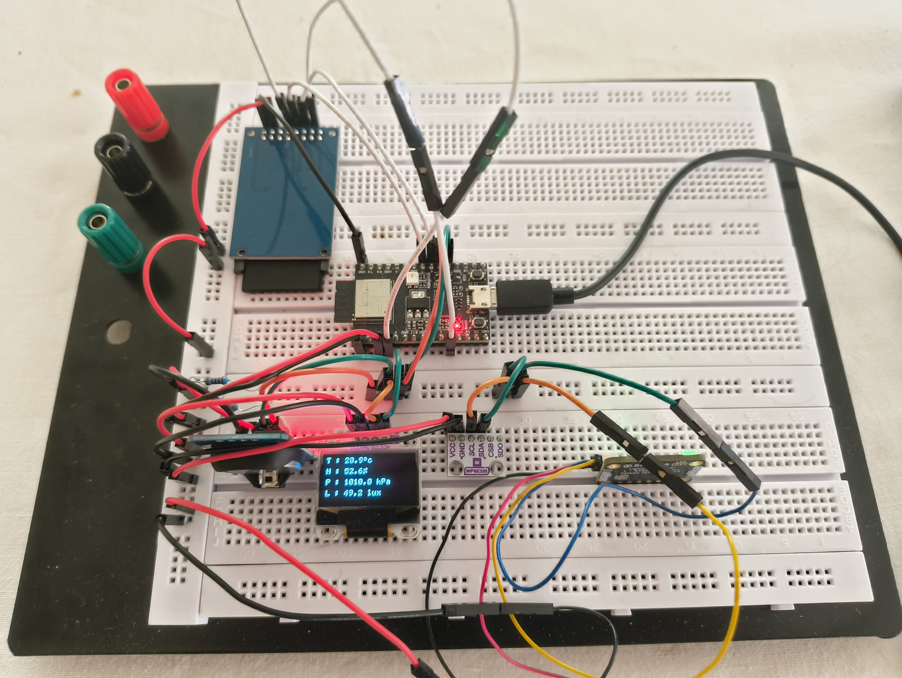
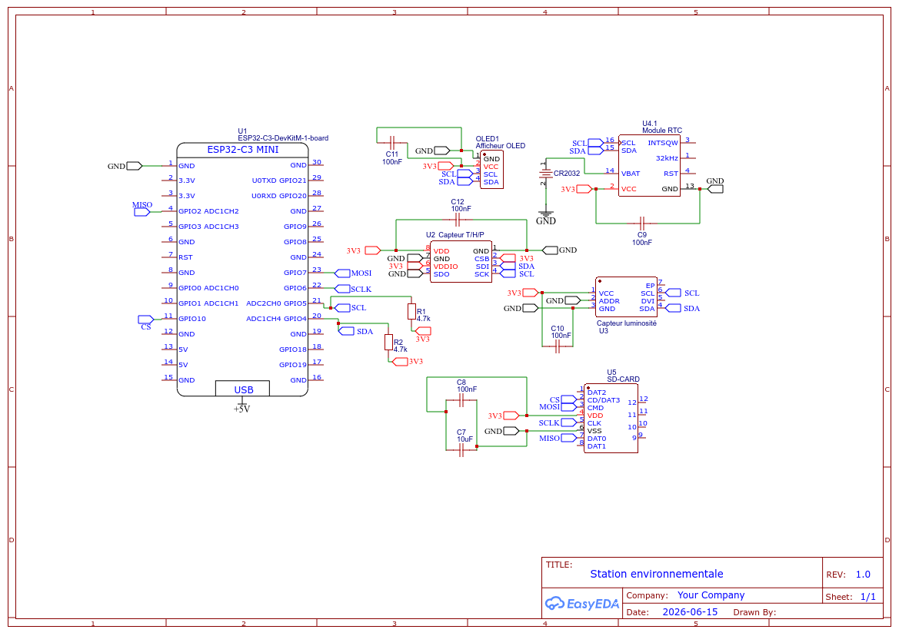

# Station environnementale connectée

Système embarqué autonome capable d'acquérir, enregistrer, afficher et transmettre des données environnementales à partir de plusieurs capteurs, construit autour d'un microcontrôleur ESP32-C3.

---

## Objectif du projet

Concevoir une station capable d'acquérir, enregistrer et exploiter des données environnementales à partir de plusieurs capteurs (température, humidité, pression, luminosité), avec horodatage, stockage local et transmission des données via Wi-Fi.

---

## Architecture du système

### Composants principaux

| Composant | Référence | Rôle |
|---|---|---|
| Microcontrôleur | ESP32-C3 DevKitM-1 | Unité de calcul et gestion des communications |
| Capteur T/H/P | Capteur température/humidité/pression (I2C) | Mesure des conditions ambiantes |
| Capteur de luminosité | Module I2C | Mesure de l'intensité lumineuse ambiante |
| Module RTC | RTC + pile CR2032 | Horodatage précis des mesures |
| Afficheur OLED | Écran I2C | Affichage local des données collectées |
| Lecteur SD | Module SD-CARD (SPI) | Enregistrement des données sur support mémoire |

---

## Technologies utilisées

- **Protocoles de communication :** UART, I2C, SPI, Wi-Fi
- **Affichage et enregistrement :** OLED / MicroSD / RTC
- **Microcontrôleur :** ESP32-C3 DevKitM-1
- **Langages :** C (firmware embarqué) / Python (analyse des données)

---

## Fonctionnalités principales

- Mesure de la température, de l'humidité et de la pression atmosphérique
- Mesure de la luminosité ambiante
- Horodatage des mesures via module RTC
- Enregistrement des données sur support mémoire (carte SD)
- Affichage local des informations collectées sur écran OLED
- Transmission du fichier de mesures via Wi-Fi local

---

## Compétences mises en œuvre

- Conception et câblage d'un système électronique multi-capteurs (breadboard, bus I2C/SPI)
- Développement firmware en C sur microcontrôleur ESP32
- Gestion de protocoles de communication série (UART/I2C/SPI)
- Lecture/écriture sur support mémoire embarqué
- Traitement et transmission de données via Wi-Fi
- Analyse de données en Python

---

## Évolutions prévues

- [ ] Tableau de bord Python pour visualisation des données
- [ ] PCB
- [ ] Alimentation autonome (batterie / solaire)

---

